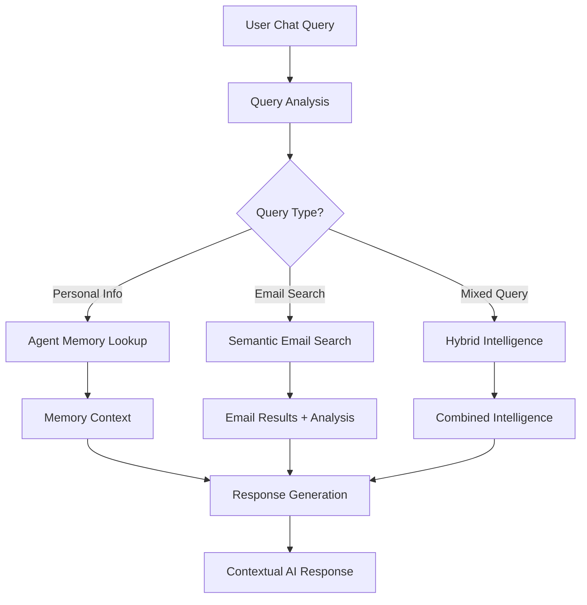

# Intelligent Chat Integration Strategy

## 🧠 Data Source Overview

Your HomeOps chat now has access to **three complementary intelligence layers**:

### **1. 🎯 Agent Memory (Neon) - Personal Context**
- **Location**: `agent_memory` table in Neon PostgreSQL
- **Purpose**: Long-term personal knowledge about user and family
- **Data**: Family members, preferences, schedules, routines
- **Scope**: Persistent, cross-conversation memory

### **2. 📧 Email Analysis (Supabase) - Communication Intelligence**
- **Location**: `email_content_analysis` table in Supabase
- **Purpose**: Structured insights from processed emails
- **Data**: Family relevance, action items, mentioned people, deadlines
- **Scope**: Communication-based intelligence

### **3. 🔍 Email Embeddings (Supabase) - Semantic Search**
- **Location**: `email_embeddings` table in Supabase
- **Purpose**: Vector similarity search of email content
- **Data**: 1536-dimensional embeddings for semantic matching
- **Scope**: Content-based retrieval

## 🤖 Integrated Chat Architecture

### **Query Processing Flow**



### **Intelligence Layer Integration**

#### **🎯 Layer 1: Agent Memory Context**
```javascript
// Always loaded for every chat response
const userMemories = await AgentMemoryService.getRelevantMemories(
  accountId,
  userQuery,
  { limit: 10, includeExpired: false }
);

// Provides: "Karen is your wife, Johnny plays soccer on Tuesdays"
```

#### **📧 Layer 2: Email Intelligence**
```javascript
// Triggered by email-related queries
const emailAnalysis = await EmailSearchService.getEmailAnalysis({
  accountId,
  filters: {
    family_relevance_score: { gte: 0.6 },
    involves_children: queryMentionsChildren,
    has_deadline: queryAsksAboutDeadlines
  },
  limit: 5
});

// Provides: Action items, deadlines, family coordination needs
```

#### **🔍 Layer 3: Semantic Email Search**
```javascript
// Triggered by content search queries
const emailResults = await SemanticSearchTool.search({
  query: extractedSearchTerms,
  maxResults: 8,
  similarity_threshold: 0.5
});

// Provides: Actual email content matching user's semantic intent
```

## 💡 Smart Query Routing

### **Query Classification System**

```javascript
class IntelligentQueryRouter {
  static analyzeQuery(userInput) {
    const queryTypes = {
      // Route to Agent Memory
      PERSONAL_INFO: /(?:my|our)\s+(wife|husband|son|daughter|child|schedule|preference)/i,
      FAMILY_FACTS: /(who is|what does|when do|where do).*(family|wife|husband|kid|child)/i,

      // Route to Email Analysis
      ACTION_ITEMS: /(what do I need|tasks|todo|deadline|due)/i,
      FAMILY_COORDINATION: /(schedule|appointment|practice|meeting|pickup)/i,

      // Route to Semantic Search
      EMAIL_CONTENT: /(find email|search email|email about|show me email)/i,
      RECENT_COMMUNICATIONS: /(recent|latest|last email|yesterday|this week)/i,

      // Hybrid queries (use multiple sources)
      COMPLEX_PLANNING: /(plan|organize|coordinate|manage|help me with)/i
    };

    return Object.entries(queryTypes).reduce((matches, [type, pattern]) => {
      if (pattern.test(userInput)) matches.push(type);
      return matches;
    }, []);
  }
}
```

## 🔄 Integration Examples

### **Example 1: "What's Johnny's soccer schedule?"**

**Query Flow**:
1. **Agent Memory**: `"Johnny plays soccer every Tuesday at 4pm"`
2. **Email Analysis**: Recent emails about schedule changes, practice updates
3. **Semantic Search**: Email content mentioning "Johnny soccer practice"

**Combined Response**:
> "Based on your stored information, Johnny has soccer practice every Tuesday at 4pm. I also found a recent email from last week mentioning practice was moved to 5pm for next Tuesday due to field maintenance. Would you like me to show you that email?"

### **Example 2: "Do I have any urgent family tasks?"**

**Query Flow**:
1. **Agent Memory**: Your family preferences and routines
2. **Email Analysis**: `has_deadline: true, involves_children: true, family_relevance_score > 0.8`
3. **Semantic Search**: Emails mentioning urgent family matters

**Combined Response**:
> "I found 3 urgent family items: 1) Johnny's permission slip is due Friday (from school email yesterday), 2) Karen mentioned wanting to schedule a dentist appointment (from your preferences), and 3) Your grocery pickup is scheduled for tomorrow at 2pm. Here are the relevant emails and details..."

### **Example 3: "Plan this weekend for the family"**

**Query Flow**:
1. **Agent Memory**: Family preferences, schedules, past activities
2. **Email Analysis**: Recent family coordination emails, event invitations
3. **Semantic Search**: Weekend-related emails, activity suggestions

**Combined Response**:
> "Based on your family preferences for outdoor activities and Italian food, plus recent emails about the farmer's market this Saturday, I suggest: Saturday morning at the farmer's market (Johnny loves the petting zoo there), lunch at Tony's Italian (Karen's favorite), and Sunday afternoon at the park. I also noticed an email about a family movie night invitation - would you like me to check if that works with your schedule?"

## ⚡ Performance Optimization

### **Smart Caching Strategy**
```javascript
class ChatIntelligenceCache {
  static memoryCache = new Map(); // Agent memory - 1 hour TTL
  static emailAnalysisCache = new Map(); // Email insights - 30 min TTL
  static semanticCache = new Map(); // Search results - 15 min TTL

  static getCombinedContext(accountId, querySignature) {
    // Return cached combined intelligence if available
    // Otherwise, orchestrate fresh lookups across all three sources
  }
}
```

### **Progressive Enhancement**
```javascript
// Start with fast agent memory, then enhance with email intelligence
const baseResponse = await getAgentMemoryContext(query);
const enhancedResponse = await Promise.allSettled([
  getEmailAnalysisContext(query),
  getSemanticSearchContext(query)
]);

// Combine intelligently based on query type and available data
```

## 🎯 Implementation Roadmap

### **Phase 1: Basic Integration** ✅ (Current)
- Agent Memory working in chat
- Semantic search as separate tool
- Email analysis stored but not integrated

### **Phase 2: Smart Query Routing**
- Implement query classification system
- Route queries to appropriate intelligence sources
- Basic response combination

### **Phase 3: Contextual Enhancement**
- Cross-reference agent memory with email insights
- Smart caching for performance
- Progressive context loading

### **Phase 4: Predictive Intelligence**
- Anticipate user needs based on patterns
- Proactive suggestions from combined data
- Smart notifications and reminders

## 🚀 Next Steps

1. **Update Chat Service**: Implement query routing logic
2. **Create Intelligence Orchestrator**: Service to combine all three data sources
3. **Enhance LangChain Tools**: Update existing tools to use combined intelligence
4. **Add Context Prioritization**: Weight different intelligence sources by relevance
5. **Implement Smart Caching**: Performance optimization for real-time chat

This architecture transforms your chat from simple Q&A into an **intelligent family assistant** that knows your preferences, understands your email communications, and can find exactly what you need!